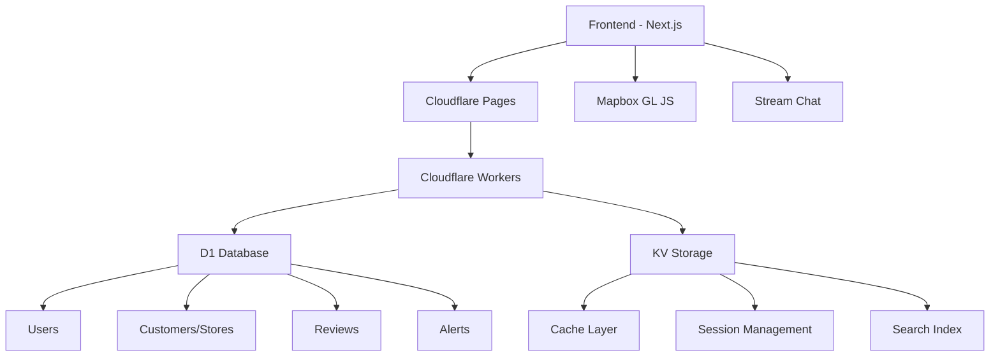

# 🏪 پلتفرم استعلام اعتبار مشتریان

<div align="center">


**پلتفرم استعلام اعتبار مشتریان برای فروشندگان و نمایندگان شرکت‌ها**

[🚀 دمو زنده](https://estelam.pages.dev) • [📖 مستندات](https://github.com/smnshzh/estelam/wiki) • [🐛 گزارش باگ](https://github.com/smnshzh/estelam/issues)

</div>

---

## ✨ ویژگی‌های کلیدی

<table>
<tr>
<td width="50%">

### 🔐 احراز هویت
- ✅ ثبت‌نام فروشندگان و نمایندگان شرکت‌ها
- ✅ مدیریت سطوح دسترسی
- ✅ امنیت پیشرفته با SuperTokens

### 🗺️ نقشه و موقعیت‌یابی
- ✅ نقشه تعاملی Mapbox
- ✅ جستجوی جغرافیایی مشتریان
- ✅ انتخاب موقعیت دقیق کسب‌وکارها
- ✅ دریافت خودکار آدرس فارسی از مختصات جغرافیایی
- ✅ قابلیت تصحیح آدرس توسط کاربر

</td>
<td width="50%">

### ⭐ استعلام اعتبار مشتریان
- ✅ نظرسنجی چندبعدی برای ارزیابی اعتبار
- ✅ نظرات فروشندگان در مورد مشتریان
- ✅ محاسبه هوشمند امتیاز اعتباری

### 💬 چت زنده
- ✅ چت خصوصی با مشتریان
- ✅ ارسال فایل و تصویر
- ✅ تاریخچه مکالمات و مذاکرات

</td>
</tr>
</table>

---

## 🏗️ معماری سیستم



---

## 🛠️ فناوری‌های استفاده شده

| دسته | فناوری | توضیحات |
|------|--------|---------|
| **Frontend** | Next.js 15 + TypeScript | فریمورک اصلی |
| **Styling** | Tailwind CSS | طراحی UI |
| **Authentication** | SuperTokens | مدیریت کاربران |
| **Database** | Cloudflare D1 | پایگاه داده SQLite |
| **Cache** | Cloudflare KV | کش و ذخیره |
| **Maps** | Mapbox GL JS | نقشه‌های تعاملی |
| **Chat** | Stream Chat | چت زنده |
| **Deployment** | Cloudflare Pages | استقرار |

---

## 🚀 راه‌اندازی سریع

### پیش‌نیازها

- Node.js 18+
- npm یا yarn
- حساب کاربری Cloudflare
- کلید API Mapbox
- حساب کاربری Stream Chat

### نصب و راه‌اندازی

```bash
# 1. کلون کردن پروژه
git clone https://github.com/smnshzh/estelam.git
cd estelam

# 2. نصب وابستگی‌ها
npm install

# 3. تنظیم متغیرهای محیطی
cp env.example .env.local

# 4. راه‌اندازی Cloudflare D1
npm run d1:create
npm run d1:migrate

# 5. راه‌اندازی Cloudflare KV
npm run kv:create
npm run kv:create-preview

# 7. اجرای پروژه
npm run dev

### تنظیمات محیطی

```env
# SuperTokens
NEXT_PUBLIC_API_DOMAIN=http://localhost:3000
NEXT_PUBLIC_WEBSITE_DOMAIN=http://localhost:3000
SUPERTOKENS_DASHBOARD_API_KEY=your-dashboard-api-key

# Mapbox
NEXT_PUBLIC_MAPBOX_ACCESS_TOKEN=your-mapbox-token

# Stream Chat
NEXT_PUBLIC_STREAM_API_KEY=your-stream-api-key
STREAM_API_SECRET=your-stream-api-secret

# Cloudflare
CLOUDFLARE_ACCOUNT_ID=your-cloudflare-account-id
CLOUDFLARE_API_TOKEN=your-cloudflare-api-token
```

---

## 📁 ساختار پروژه

```
estelam/
├── 📁 src/
│   ├── 📁 app/                    # صفحات Next.js
│   │   ├── 📁 auth/              # احراز هویت
│   │   ├── 📁 dashboard/         # دشبورد
│   │   ├── 📁 map/               # نقشه
│   │   ├── 📁 customers/         # مشتریان/مغازه‌ها
│   │   ├── 📁 chat/              # چت
│   │   ├── 📁 alerts/            # هشدارها
│   │   └── 📁 admin/             # مدیریت
│   ├── 📁 components/            # کامپوننت‌ها
│   ├── 📁 lib/                   # کتابخانه‌ها
│   │   ├── d1-database.ts        # سرویس D1
│   │   └── kv-service.ts         # سرویس KV
│   └── 📁 pages/                 # API routes
├── 📁 database/
│   └── schema.sql               # اسکریپت پایگاه داده
├── 📄 wrangler.toml             # پیکربندی Cloudflare
└── 📄 README.md                 # این فایل
```

---

## 📊 Import داده‌های CSV

### قابلیت‌های Import

- **پشتیبانی از فایل‌های CSV بزرگ**: پردازش به صورت batch برای جلوگیری از overload
- **اعتبارسنجی مختصات**: بررسی محدوده جغرافیایی ایران
- **دریافت خودکار آدرس**: استفاده از API معکوس جغرافیایی فارسی
- **محاسبه امتیاز اعتبار**: تبدیل از مقیاس 5 به 100
- **تعیین سطح ریسک**: بر اساس امتیاز مشتری

### فرمت فایل CSV مورد نیاز

```csv
token,name,category,address,latitude,longitude,phones,rating,neighborhood_name,city_name
1EHi6KqSGhVCTe,خشکبار حبوبات لوازم قنادی,آجیل و خشکبار,"کرج،کوی کارمندان جنوبی،خ رسالت",35.8273058,50.9710077,9124665376,5,کوی کارمندان جنوبی,شهر کرج
```

### روش‌های Import

#### 1. از طریق CLI
```bash
npm run import:csv sample.csv
```

#### 2. از طریق پنل مدیریت
- مراجعه به `/admin/import`
- آپلود فایل CSV
- مشاهده نتایج import

### API معکوس جغرافیایی

پروژه از API معکوس جغرافیایی فارسی استفاده می‌کند:
- **URL**: `https://reverse-geocoding.raah.ir/v1/`
- **ورودی**: مختصات جغرافیایی (longitude, latitude)
- **خروجی**: آدرس فارسی فرمت شده

مثال:
```json
{
  "formatted_address": "تهران،نصرت،خ کارگر شمالی،خ شهید مستعلی،پ ۵",
  "components": [
    {"full_name": "شهر تهران", "type": "city"},
    {"full_name": "محله نصرت", "type": "neighborhood"},
    {"full_name": "خیابان کارگر شمالی", "type": "street"}
  ]
}
```

---

### احراز هویت
```http
POST /api/auth/signup     # ثبت‌نام
POST /api/auth/signin     # ورود
POST /api/auth/signout    # خروج
```

### مشتریان/مغازه‌ها
```http
GET  /api/customers         # لیست مشتریان/مغازه‌ها
POST /api/customers         # ثبت مشتری/مغازه جدید
GET  /api/customers/[id]    # اطلاعات مشتری/مغازه
POST /api/customers/vote    # رای تایید
```

### نظرات
```http
GET  /api/reviews?customerId=[id]  # نظرات مشتری/مغازه
POST /api/reviews                # ثبت نظر
```

### هشدارها
```http
GET  /api/alerts          # لیست هشدارها
POST /api/alerts          # ایجاد هشدار
```

### جستجو و Analytics
```http
GET /api/search?q=[query]  # جستجو
GET /api/analytics         # آمار کلی
```

---

## 🌐 استقرار روی Cloudflare

### 1. تنظیمات Pages

```bash
# Build command
npm run build

# Build output directory
.next
```

### 2. متغیرهای محیطی

در Cloudflare Pages Dashboard:
- `NEXT_PUBLIC_API_DOMAIN`
- `NEXT_PUBLIC_WEBSITE_DOMAIN`
- `SUPERTOKENS_DASHBOARD_API_KEY`
- `NEXT_PUBLIC_MAPBOX_ACCESS_TOKEN`
- `NEXT_PUBLIC_STREAM_API_KEY`
- `STREAM_API_SECRET`

### 3. اتصال D1 و KV

- **D1 Database**: `estelam-db`
- **KV Namespace**: `ESTELAM_KV`

---

## 📊 ویژگی‌های Cloudflare

### 🗄️ D1 Database
- **SQLite-based**: پایگاه داده در Edge
- **Global Distribution**: توزیع جهانی
- **ACID Compliance**: تراکنش‌های امن
- **Auto-scaling**: مقیاس‌پذیری خودکار

### ⚡ KV Storage
- **Edge Caching**: کش در Edge
- **Session Management**: مدیریت session
- **Search Index**: ایندکس جستجو
- **Analytics**: آمار و متریک‌ها
- **Rate Limiting**: محدودیت نرخ

---

## 🎯 نحوه استفاده

### برای فروشندگان/نمایندگان شرکت‌ها
1. 🔐 ثبت‌نام در سیستم
2. 🗺️ جستجو و مشاهده مشتریان روی نقشه
3. ⭐ ثبت نظر و ارزیابی اعتبار مشتریان
4. 💬 استفاده از چت برای مذاکره با مشتریان

### برای مشتریان/کسب‌وکارها
1. 📝 تکمیل پروفایل کسب‌وکار
2. 📍 انتخاب موقعیت روی نقشه
3. 🔔 دریافت اطلاع‌رسانی‌ها
4. 💬 پاسخ‌گویی در چت

### برای ادمین‌ها
1. ✅ تایید مشتریان و فروشندگان
2. 👥 مدیریت کاربران
3. 📊 نظارت بر سیستم استعلام اعتبار

---

## 🤝 مشارکت

مشارکت در این پروژه بسیار خوشایند است!

1. 🍴 Fork کنید
2. 🌿 Branch جدید بسازید (`git checkout -b feature/amazing-feature`)
3. 💾 Commit کنید (`git commit -m 'Add amazing feature'`)
4. 📤 Push کنید (`git push origin feature/amazing-feature`)
5. 🔄 Pull Request ایجاد کنید

---

## 📄 مجوز

این پروژه تحت مجوز [MIT](LICENSE) منتشر شده است.

---

## 📞 پشتیبانی

- 🐛 [گزارش باگ](https://github.com/smnshzh/estelam/issues)
- 💡 [درخواست ویژگی](https://github.com/smnshzh/estelam/issues)
- 📧 ایمیل: support@estelam.com

---

## 🗺️ نقشه راه

- [ ] 📱 اپلیکیشن موبایل
- [ ] 🌍 پشتیبانی چندزبانه
- [ ] 💳 سیستم پرداخت
- [ ] 📈 تحلیل‌های پیشرفته
- [ ] 🔌 API عمومی

---

<div align="center">

**ساخته شده با ❤️ در ایران**

[⭐ ستاره دهید](https://github.com/smnshzh/estelam) • [🍴 Fork کنید](https://github.com/smnshzh/estelam/fork) • [👀 Watch کنید](https://github.com/smnshzh/estelam)

</div>